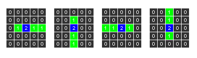
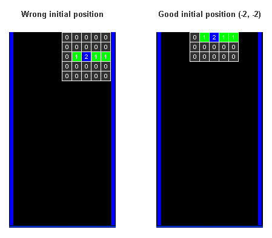
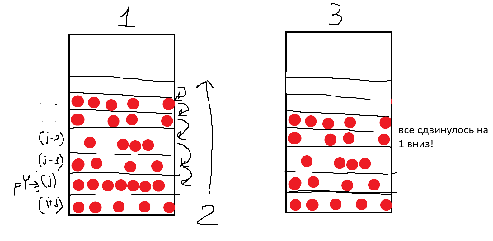

# Техническое руководство

## Управление
- Esc - выход
- z - развернуть фигуру
- x - сбросить фигуру
- влево, вправо, вниз - перемещать фигуру

## Демонтстрация работы

<video width="640" height="360" controls>
    <source src="media/tetris_showcase.mp4" type="video/mp4">
    Тут должно было быть видео, если его нет все сломалось.
</video>

## Принцип работы фигур

В тетрисе всего 7 фигур, у каждой из которых есть 4 возможных ориентации и "pivot", клетка, вокруг которой вращается фигура. Для реализации этого в коде будем использовать матрицу 5x5, где 0 - пустая клетка, 1 - часть фигуры, 2 - пивот. посколько фигур 7 и у каждой фигуры 4 ориентации получаем массив `[7][4][5][5]`. Для примера рассмотрим длинную палку, вот так будет выглядеть код и его графическая интерпретация:
```cpp
 {
  {
   {0, 0, 0, 0, 0},
   {0, 0, 0, 0, 0},
   {0, 1, 2, 1, 1},
   {0, 0, 0, 0, 0},
   {0, 0, 0, 0, 0}
   },
  {
   {0, 0, 0, 0, 0},
   {0, 0, 1, 0, 0}, 
   {0, 0, 2, 0, 0},
   {0, 0, 1, 0, 0},
   {0, 0, 1, 0, 0}
   },
  {
   {0, 0, 0, 0, 0},
   {0, 0, 0, 0, 0},
   {1, 1, 2, 1, 0},
   {0, 0, 0, 0, 0},
   {0, 0, 0, 0, 0}
   },
  {
   {0, 0, 1, 0, 0},
   {0, 0, 1, 0, 0},
   {0, 0, 2, 0, 0},
   {0, 0, 1, 0, 0},
   {0, 0, 0, 0, 0}
   }
  }
  ```
  

  Так проделываем со всеми фигурами.

  Дальше нужно правильно расчитывать начальную позицию для появления. Изначально, при добавлении фигуры по центру, в центре будет не ее pivot, на `[0][0]` точка матрицы этой фигуры. Чтобы этого избежать, для каждой фигуры надо добавить смещение. Для этого нужен массив со смещениями по x и y для каждой фигуры со всеми ориетациями. Вот пример для все той же длинной палки
  
  
  ```cpp
  {
	{-2, -2},
    {-2, -3},
    {-2, -2},
    {-2, -3}
  },
  ```

Дальше создаем класс `Pieces` в хедере со вспомогательными функциями для упрощенной работы.

```cpp
class Pieces
{
public:

	int GetBlockType		(int pPiece, int pRotation, int pX, int pY);
	int GetXInitialPosition (int pPiece, int pRotation);
	int GetYInitialPosition (int pPiece, int pRotation);
};
```

Все три функции просто берут нужный элемент массива:

```cpp
int Pieces::GetBlockType (int pPiece, int pRotation, int pX, int pY)
{
	return mPieces [pPiece][pRotation][pX][pY];
}

int Pieces::GetXInitialPosition (int pPiece, int pRotation)
{
	return mPiecesInitialPosition [pPiece][pRotation][0];
}

int Pieces::GetYInitialPosition (int pPiece, int pRotation)
{
	return mPiecesInitialPosition [pPiece][pRotation][1];
}
```

## Доска

Самая комплексная часть программы. Этот класс (`Board`) отвечает за такие функции, как всевозможные проверки (на завершение игры, на возможность удалить линии, на возможнось переместить падающую фигуру), сохранение статуса каждой клетке на доске. Также в этом классе больше всего настроек для кастомизации игры (размер клетки, поля и т. д.).

**Board.h**
```cpp
#ifndef _BOARD_
#define _BOARD_

// ------ Includes -----

#include "Pieces.h"

// ------ Defines -----

#define BOARD_LINE_WIDTH 6			// Width of each of the two lines that delimit the board
#define BLOCK_SIZE 16				// Width and Height of each block of a piece
#define BOARD_POSITION 320			// Center position of the board from the left of the screen
#define BOARD_WIDTH 10				// Board width in blocks 
#define BOARD_HEIGHT 20				// Board height in blocks
#define MIN_VERTICAL_MARGIN 20		// Minimum vertical margin for the board limit 		
#define MIN_HORIZONTAL_MARGIN 20	// Minimum horizontal margin for the board limit
#define PIECE_BLOCKS 5				// Number of horizontal and vertical blocks of a matrix piece

class Board
{
public:

	Board						(Pieces *pPieces, int pScreenHeight);

	int GetXPosInPixels			(int pPos);
	int GetYPosInPixels			(int pPos);
	bool IsFreeBlock			(int pX, int pY);
	bool IsPossibleMovement		(int pX, int pY, int pPiece, int pRotation);
	void StorePiece				(int pX, int pY, int pPiece, int pRotation);
	void DeletePossibleLines	();
	bool IsGameOver				();

private:

	enum { POS_FREE, POS_FILLED };			// POS_FREE = free position of the board; POS_FILLED = filled position of the board
	int mBoard [BOARD_WIDTH][BOARD_HEIGHT];	// Board that contains the pieces
	Pieces *mPieces;
	int mScreenHeight;

	void InitBoard();
	void DeleteLine (int pY);
};

#endif // _BOARD_
```

Теперь поподробнее о главных фукнциях.

`InitBoard()` проходиться по всей доске и выставляет значение *пустая* для каждой клетки.

```cpp
void Board::InitBoard()
{
	for (int i = 0; i < BOARD_WIDTH; i++)
		for (int j = 0; j < BOARD_HEIGHT; j++)
			mBoard[i][j] = POS_FREE;
}
```
`StorePiece()` вызывается тогда, когда текущая фигура завершает свое движение. `i1, j1` итереруют абсолютную позицию, а `i2, j2` - позицию внутри 5x5 матрицы текущей фигуры. Если значение внутри матрицы != 0, значит это часть фигуры, и статус клетки на основной доске изменяется на `POS_FILLED`.

```cpp
void Board::StorePiece (int pX, int pY, int pPiece, int pRotation)
{
	// Store each block of the piece into the board
	for (int i1 = pX, i2 = 0; i1 < pX + PIECE_BLOCKS; i1++, i2++)
	{
		for (int j1 = pY, j2 = 0; j1 < pY + PIECE_BLOCKS; j1++, j2++)
		{	
			// Store only the blocks of the piece that are not holes
			if (mPieces->GetBlockType (pPiece, pRotation, j2, i2) != 0)		
				mBoard[i1][j1] = POS_FILLED;	
		}
	}
}
```
`IsGameOver()` просто проверяет, есть ли хоть одна заполненная клетка в верхнем ряду. Если есть - игра окончена.
```cpp
bool Board::IsGameOver()
{
	for (int i = 0; i < BOARD_WIDTH; i++)
	{
		if (mBoard[i][0] == POS_FILLED) return true;
	}

	return false;
}
```
`DeleteLine(int pY)` принимает строчку, которую нужно удалить, и просто сдвигает все строчки выше этой на 1 вниз. Детальное визуальное объяснение прилагается.
```cpp
void Board::DeleteLine (int pY)
{
	for (int j = pY; j > 0; j--)
	{
		for (int i = 0; i < BOARD_WIDTH; i++)
		{
			mBoard[i][j] = mBoard[i][j-1];
		}
	}	
}
```


`DeletePossibleLines()` проходится циклом по всей доске и проверяет, какие линии можно удалить. Линия удаляется если количество заполненных клеток равно ширине доски.
```cpp
void Board::DeletePossibleLines ()
{
	for (int j = 0; j < BOARD_HEIGHT; j++)
	{
		int i = 0;
		while (i < BOARD_WIDTH)
		{
			if (mBoard[i][j] != POS_FILLED) break;
			i++;
		}

		if (i == BOARD_WIDTH) DeleteLine (j);
	}
}
```

`IsFreeBlock(int pX, int pY)` проверяет статус клетки.
```cpp
bool Board::IsFreeBlock (int pX, int pY)
{
	if (mBoard [pX][pY] == POS_FREE) return true; else return false;
}
```
`IsPossibleMovement(int pX, int pY, int pPiece, int pRotation)` проверяет возможность фигуры сделать какое-либо движение. Первым делом проверяется не пытается ли фигура выбраться за левую, правую и левую границу доски. Далее проверяется соприкасается ли текущая фигура с уже существующими.
```cpp
bool Board::IsPossibleMovement (int pX, int pY, int pPiece, int pRotation)
{
	for (int i1 = pX, i2 = 0; i1 < pX + PIECE_BLOCKS; i1++, i2++)
	{
		for (int j1 = pY, j2 = 0; j1 < pY + PIECE_BLOCKS; j1++, j2++)
		{	
			// Check if the piece is outside the limits of the board
			if (	i1 < 0 			|| 
				i1 > BOARD_WIDTH  - 1	||
				j1 > BOARD_HEIGHT - 1)
			{
				if (mPieces->GetBlockType (pPiece, pRotation, j2, i2) != 0)
					return false;		
			}

			// Check if the piece have collisioned with a block already stored in the map
			if (j1 >= 0)	
			{
				if ((mPieces->GetBlockType (pPiece, pRotation, j2, i2) != 0) &&
					(!IsFreeBlock (i1, j1))	)
					return false;
			}
		}
	}
	return true;
}
```

## Игра

`Game` содержит функции для инициализации игры, создания фигур и их отрисовки, настройку скорости игры. Он включает функционал всех остальных классов.

**Game.h**
```cpp
#ifndef _GAME_
#define _GAME_

// ------ Includes -----

#include "Board.h"
#include "Pieces.h"
#include "IO.h"
#include <time.h>

// ------ Defines -----

#define WAIT_TIME 700			// Number of milliseconds that the piece remains before going 1 block down */ 


// --------------------------------------------------------------------------------
//									 Game
// --------------------------------------------------------------------------------

class Game
{
public:

	Game			(Board *pBoard, Pieces *pPieces, IO *pIO, int pScreenHeight);

	void DrawScene ();
	void CreateNewPiece ();

	int mPosX, mPosY;				// Position of the piece that is falling down
	int mPiece, mRotation;			// Kind and rotation the piece that is falling down

private:

	int mScreenHeight;				// Screen height in pixels
	int mNextPosX, mNextPosY;		// Position of the next piece
	int mNextPiece, mNextRotation;	// Kind and rotation of the next piece

	Board *mBoard;
	Pieces *mPieces;
	IO *mIO;

	int GetRand (int pA, int pB);
	void InitGame();
	void DrawPiece (int pX, int pY, int pPiece, int pRotation);
	void DrawBoard ();
};

#endif // _GAME_
```

`InitGame()` создает первую и вторую фигуру и задает их позицию. Фигуры выбираются случайным образом с помощью функции `:GetRand(int pA, int pB)`.

```cpp
int Game::GetRand (int pA, int pB)
{
	return rand () % (pB - pA + 1) + pA;
}

void Game::InitGame()
{
	srand ((unsigned int) time(NULL));

	// First piece
	mPiece			= GetRand (0, 6);
	mRotation		= GetRand (0, 3);
	mPosX 			= (BOARD_WIDTH / 2) + mPieces->GetXInitialPosition (mPiece, mRotation);
	mPosY 			= mPieces->GetYInitialPosition (mPiece, mRotation);

	//  Next piece
	mNextPiece 		= GetRand (0, 6);
	mNextRotation 	= GetRand (0, 3);
	mNextPosX 		= BOARD_WIDTH + 5;
	mNextPosY 		= 5;	
}
```

`CreateNewPiece()` делает следущую фигуру текущей и создает новую следующую фигуру.

```cpp
void Game::CreateNewPiece()
{
	// The new piece
	mPiece			= mNextPiece;
	mRotation		= mNextRotation;
	mPosX 			= (BOARD_WIDTH / 2) + mPieces->GetXInitialPosition (mPiece, mRotation);
	mPosY 			= mPieces->GetYInitialPosition (mPiece, mRotation);

	// Random next piece
	mNextPiece 		= GetRand (0, 6);
	mNextRotation 	= GetRand (0, 3);
}
```

`DrawPiece(int pX, int pY, int pPiece, int pRotation)` отвечает за логику отрисовки текущей фигуры. Вложенным циклом перебирается матрица 5x5, pivot фигуры закрашивается синим, остальные части зеленым.

```cpp
void Game::DrawPiece (int pX, int pY, int pPiece, int pRotation)
{
	color mColor;				// Color of the block 

	// Obtain the position in pixel in the screen of the block we want to draw
	int mPixelsX = mBoard->GetXPosInPixels (pX);
	int mPixelsY = mBoard->GetYPosInPixels (pY);

	// Travel the matrix of blocks of the piece and draw the blocks that are filled
	for (int i = 0; i < PIECE_BLOCKS; i++)
	{
		for (int j = 0; j < PIECE_BLOCKS; j++)
		{
			// Get the type of the block and draw it with the correct color
			switch (mPieces->GetBlockType (pPiece, pRotation, j, i))
			{
				case 1: mColor = GREEN; break;	// For each block of the piece except the pivot
				case 2: mColor = BLUE; break;	// For the pivot
			}
			
			if (mPieces->GetBlockType (pPiece, pRotation, j, i) != 0)
				mIO->DrawRectangle	(mPixelsX + i * BLOCK_SIZE, 
									mPixelsY + j * BLOCK_SIZE, 
									(mPixelsX + i * BLOCK_SIZE) + BLOCK_SIZE - 1, 
									(mPixelsY + j * BLOCK_SIZE) + BLOCK_SIZE - 1, 
									mColor);
		}
	}
}
```

`DrawBoard()` отвечает за логику отрисовки остальной доски, а именно ее границ и уже упавших фигур. Для границ используются переменные из класса `Board`, а для упавших фигур просто перебирается вся доска и каждая клетка проверяется на заполненность.

```cpp
void Game::DrawBoard ()
{
	// Calculate the limits of the board in pixels	
	int mX1 = BOARD_POSITION - (BLOCK_SIZE * (BOARD_WIDTH / 2)) - 1;
	int mX2 = BOARD_POSITION + (BLOCK_SIZE * (BOARD_WIDTH / 2));
	int mY = mScreenHeight - (BLOCK_SIZE * BOARD_HEIGHT);

	// Rectangles that delimits the board
	mIO->DrawRectangle (mX1 - BOARD_LINE_WIDTH, mY, mX1, mScreenHeight - 1, BLUE);
	mIO->DrawRectangle (mX2, mY, mX2 + BOARD_LINE_WIDTH, mScreenHeight - 1, BLUE);

	// Drawing the blocks that are already stored in the board
	mX1 += 1;
	for (int i = 0; i < BOARD_WIDTH; i++)
	{
		for (int j = 0; j < BOARD_HEIGHT; j++)
		{	
			// Check if the block is filled, if so, draw it
			if (!mBoard->IsFreeBlock(i, j))	
				mIO->DrawRectangle (	mX1 + i * BLOCK_SIZE, 
										mY + j * BLOCK_SIZE, 
										(mX1 + i * BLOCK_SIZE) + BLOCK_SIZE - 1, 
										(mY + j * BLOCK_SIZE) + BLOCK_SIZE - 1, 
										RED);
		}
	}	
}
```

`DrawScene()` вызывает ранее созданые функции для отрисоки доски, текущей и следующей фигуры.

```cpp
void Game::DrawScene ()
{
	DrawBoard ();
	DrawPiece (mPosX, mPosY, mPiece, mRotation);
	DrawPiece (mNextPosX, mNextPosY, mNextPiece, mNextRotation);
}
```
## Ввод и вывод
Класс `IO` отвечает за обработку ввода с клавиатуры и вывода результата на экран (отрисовку игры). Благодаря грамотной архитектуре проекта, ввод и вывод обособлены от самой игровой логики. Это означает, что при желании можно использовать другой рендерер.

**IO.h**
```cpp
#ifndef _IO_
#define _IO_

// ------ Includes -----

#include <SDL.h>

// ------ Enums -----

enum color {BLACK, RED, GREEN, BLUE, CYAN, MAGENTA, YELLOW, WHITE, COLOR_MAX}; // Colors


// --------------------------------------------------------------------------------
//									 IO
// --------------------------------------------------------------------------------

class IO
{
public:

	IO						();

	void DrawRectangle		(int pX1, int pY1, int pX2, int pY2, enum color pC);
	void ClearScreen		();
	int GetScreenHeight		();
	int InitGraph			();
	int Pollkey				();
	int Getkey				();
	void UpdateScreen		();

};

#endif // _IO_
```

Функция `InitGraph()` создает окно и рендерер, проверяя каждый шаг на наличие ошибок. Далее мы делаем цвет рисовки черным, очищаем им буффер и выводим результат на экране.

```cpp
static SDL_Window* mWindow = nullptr;
static SDL_Renderer* mRenderer = nullptr;

static SDL_Color mColors[COLOR_MAX] = {
    {0, 0, 0, 255},       // BLACK
    {255, 0, 0, 255},     // RED
    {0, 255, 0, 255},     // GREEN
    {0, 0, 255, 255},     // BLUE
    {0, 255, 255, 255},   // CYAN
    {255, 0, 255, 255},   // MAGENTA
    {255, 255, 0, 255},   // YELLOW
    {255, 255, 255, 255}  // WHITE
};

IO::IO() {
    InitGraph();
}

int IO::InitGraph()
{
    if (SDL_Init(SDL_INIT_VIDEO) < 0)
    {
        fprintf(stderr, "Couldn't initialize SDL: %s\n", SDL_GetError());
        return 1;
    }

    mWindow = SDL_CreateWindow("Tetris", SDL_WINDOWPOS_CENTERED, SDL_WINDOWPOS_CENTERED, 640, 480, SDL_WINDOW_SHOWN);
    if (!mWindow)
    {
        fprintf(stderr, "Couldn't create window: %s\n", SDL_GetError());
        SDL_Quit();
        return 2;
    }

    mRenderer = SDL_CreateRenderer(mWindow, -1, SDL_RENDERER_ACCELERATED | SDL_RENDERER_PRESENTVSYNC);
    if (!mRenderer)
    {
        fprintf(stderr, "Couldn't create renderer: %s\n", SDL_GetError());
        SDL_DestroyWindow(mWindow);
        SDL_Quit();
        return 3;
    }

    SDL_SetRenderDrawColor(mRenderer, mColors[BLACK].r, mColors[BLACK].g, mColors[BLACK].b, mColors[BLACK].a);
    SDL_RenderClear(mRenderer);
    SDL_RenderPresent(mRenderer);

    return 0;
}
```
`ClearScreen()` делает цвет рисовки черным и очищаеи им буффер (не выводя результат на экран), `UpdateScreen()` обновляет кадр.

```cpp
void IO::ClearScreen() {
    SDL_SetRenderDrawColor(mRenderer, mColors[BLACK].r, mColors[BLACK].g, mColors[BLACK].b, mColors[BLACK].a);
    SDL_RenderClear(mRenderer);
}

void IO::UpdateScreen() {
    SDL_RenderPresent(mRenderer);
}
```

`GetScreenHeight()` возвращает высоту экрана.
```cpp
int IO::GetScreenHeight() {
    int w, h;
    SDL_GetWindowSize(mWindow, &w, &h);
    return h;
}
```

`DrawRectangle(int pX1, int pY1, int pX2, int pY2, enum color pC)` заполняет прямоугольник выбранным цветом.

```cpp
void IO::DrawRectangle(int pX1, int pY1, int pX2, int pY2, enum color pC) {
    SDL_Rect rect;
    rect.x = pX1;
    rect.y = pY1;
    rect.w = pX2 - pX1;
    rect.h = pY2 - pY1;
    SDL_SetRenderDrawColor(mRenderer, mColors[pC].r, mColors[pC].g, mColors[pC].b, mColors[pC].a);
    SDL_RenderFillRect(mRenderer, &rect);
}
```

`Pollkey()` и `Getkey()` отвечают за получение ввода с клавиатуры. Их отличие в том, что poll это делает не прерывая работу программы, а get останавливает другие процессы в ожидании ввода.
```cpp
int IO::Pollkey() {
    SDL_Event event;
    while (SDL_PollEvent(&event)) {
        switch (event.type) {
            case SDL_KEYDOWN:
                return event.key.keysym.sym;
            case SDL_QUIT:
                exit(3);
        }
    }
    return -1;
}

int IO::Getkey() {
    SDL_Event event;
    while (true) {
        if (SDL_WaitEvent(&event)) {
            if (event.type == SDL_KEYDOWN)
                break;
            if (event.type == SDL_QUIT)
                exit(3);
        }
    }
    return event.key.keysym.sym;
}
```

## Main

Основная функция, запускающая программу.

В начале создаются все необходимые переменные.
```cpp
IO mIO;
int mScreenHeight = mIO.GetScreenHeight();

// Pieces
Pieces mPieces;

// Board
Board mBoard (&mPieces, mScreenHeight);

// Game
Game mGame (&mBoard, &mPieces, &mIO, mScreenHeight);

// Get the actual clock milliseconds (SDL)
unsigned long mTime1 = SDL_GetTicks();
```
Далее начинается основной цикл. Весь отсальной код будет внутри него. Каждый кадр экран очищается и отрисовывается заново. Все изменения происходят в функции `DrawScene()`.

```cpp
bool quit = false;

while (!quit)
{
	// ----- Draw -----

	mIO.ClearScreen (); 		// Clear screen
	mGame.DrawScene ();			// Draw staff
	mIO.UpdateScreen ();		// Put the graphic context in the screen
```

После этого обрабатывается ввод с клавиатуры, тут же и реализация всех функий управления. `Esc` закрывает окно, `left, right, down` двигает фигуру после проверки на возможность движениия, `z` поворачивает фигуру, `x` опускает фигуру как можно ниже, сохраняет ее на доску и удаляет все возможные линии.

```cpp
int mKey = mIO.Pollkey();

switch (mKey)
{
	case (SDLK_ESCAPE):
		quit = true;
		break;
	case (SDLK_RIGHT): 
	{
		if (mBoard.IsPossibleMovement (mGame.mPosX + 1, mGame.mPosY, mGame.mPiece, mGame.mRotation))
			mGame.mPosX++;
			break;
	}

	case (SDLK_LEFT): 
	{
		if (mBoard.IsPossibleMovement (mGame.mPosX - 1, mGame.mPosY, mGame.mPiece, mGame.mRotation))
			mGame.mPosX--;	
		break;
	}

	case (SDLK_DOWN):
	{
		if (mBoard.IsPossibleMovement (mGame.mPosX, mGame.mPosY + 1, mGame.mPiece, mGame.mRotation))
			mGame.mPosY++;	
		break;
	}

	case (SDLK_x):
	{
		// Check collision from up to down
		while (mBoard.IsPossibleMovement(mGame.mPosX, mGame.mPosY, mGame.mPiece, mGame.mRotation)) { mGame.mPosY++; }
	
		mBoard.StorePiece (mGame.mPosX, mGame.mPosY - 1, mGame.mPiece, mGame.mRotation);

		mBoard.DeletePossibleLines ();

		if (mBoard.IsGameOver())
		{
			mIO.Getkey();
			quit = true;
		}

		mGame.CreateNewPiece();

		break;
	}

	case (SDLK_z):
	{
		if (mBoard.IsPossibleMovement (mGame.mPosX, mGame.mPosY, mGame.mPiece, (mGame.mRotation + 1) % 4))
			mGame.mRotation = (mGame.mRotation + 1) % 4;

		break;
	}
}
```

В самом конце мы двигаем фигуру через определенный интервал времени (настраиваемый в `Game.h`). Когда фигура больше не может двигаться мы сохраняем ее на доску, проверям возможность удалить линии и завершаем игру, если фигура слишком высоко.

```cpp
	unsigned long mTime2 = SDL_GetTicks();

	if ((mTime2 - mTime1) > WAIT_TIME)
	{
		if (mBoard.IsPossibleMovement (mGame.mPosX, mGame.mPosY + 1, mGame.mPiece, mGame.mRotation))
		{
			mGame.mPosY++;
		}
		else
		{
			mBoard.StorePiece (mGame.mPosX, mGame.mPosY, mGame.mPiece, mGame.mRotation);

			mBoard.DeletePossibleLines ();

			if (mBoard.IsGameOver())
			{
				mIO.Getkey();
				quit = true;
			}

			mGame.CreateNewPiece();
		}

		mTime1 = SDL_GetTicks();
	}
}

return 0;
```

## Модификации

Из-за того, что оригинальный туториал очень старый (последнее обновление в 2012 году), используемая версия SDL устарела и больше не используется. Поэтому я обновил код `IO.h` и `IO.cpp`, чтобы он работал с более новой версией SDL2 2.24.0. Для этого я заменил устаревшие функции их современными аналогами. Например, вместо `SDL_Surface` используется `SDL_Renderer`, вместо `boxColor` используется `SDL_SetRenderDrawColor` и `SDL_RenderFillRect`, `SDL_RenderPresent(renderer)` вместо `SDL_Flip(surface)`. Кроме этого было исправлено несколько багов и оптимизирвана функция `main` (исправлена работа `x`, добавлено более оптимизированное условия выхода из программы), и другие небольшие исправления.